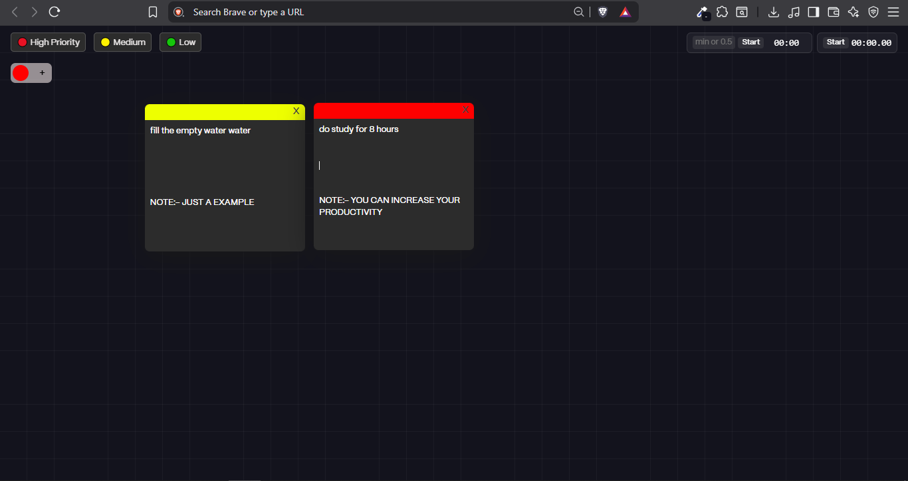

# 🗒️ Sticky Notes: Your Browser's New Best Friend! 🚀

Unlock your productivity with our modern, minimal, and interactive sticky notes app, designed specifically for your browser! 

**Write, Organize, and Stay on Top of Your Tasks**

Effortlessly jot down your daily routine, to-dos, and reminders. Our app ensures they're always visible and easily accessible, helping you stay focused and on track. 🔄

**Boost Your Productivity with Timers and Stopwatch**

Take your productivity to the next level with our built-in timer and stopwatch. Set countdowns, track your progress, and stay motivated with every tick! ⏰⏱️

## ☢ Working Link:- [azad-sticky-notes](https://azad-sticky-notes.netlify.app/) 

---

## 📑 Index

1. [index.html](#indexhtml) - The Heart of the App
2. [style.css](#stylecss) - The Style Powerhouse
3. [script.js](#scriptjs) - The Brain of the App
4. [manifest.json & Chrome Extension Setup](#manifestjson--chrome-extension-setup) - Make it Your New Tab

---

## 1. `index.html`

The core of our app! 🌟

- **Navigation Bar:** Priority labels (High, Medium, Low) for your notes, plus a built-in timer and stopwatch.
- **Main Area:**  
  - Note creation form (choose color, add note).
  - Sticky notes container (your notes appear here, draggable and editable).
- **Script:** Loads all the interactive logic from `script.js`.

---

## 2. `style.css`

The style powerhouse! 💪

- **Modern Dark Theme:** Sleek, distraction-free background.
- **Responsive Layout:** Fixed nav, floating note form, and grid background.
- **Sticky Notes:** Vibrant, colored borders for priority, draggable, and shadowed for a real sticky note feel.
- **Timer & Stopwatch:** Stylish, easy-to-read controls.

---

## 3. `script.js`

The brain of the app! 🧠

- **Sticky Notes:**  
  - Create, edit, drag, and delete notes.
  - Notes are saved in your browser (localStorage) — they persist even after refresh!
- **Timer:**  
  - Set a countdown (minutes or seconds), with alarm sound when time’s up.
  - Pause, resume, and reset controls.
- **Stopwatch:**  
  - Start, stop, and reset.
  - Millisecond precision for tracking tasks.
- **Drag & Drop:**  
  - Move notes anywhere on the screen.
  - Positions are saved automatically.

---

## 4. `manifest.json` & Chrome Extension Setup

Want sticky notes on every new tab? 🚀

This project is ready to be used as a Chrome Extension!

### How to Install:

1. **Download or Clone this Repository.**
2. **Open Chrome** and go to `chrome://extensions/`
3. **Enable "Developer mode"** (top right).
4. **Click "Load unpacked"** and select the project folder.
5. Now, every time you open a new tab, your Sticky Notes app will appear!

- `manifest.json` tells Chrome to use `index.html` as your new tab page.
- All your notes and settings are stored locally in your browser.

---

## 🚀 Features

- 📝 Create, edit, and delete sticky notes
- 🎨 Choose your note color (priority)
- ⏰ Built-in timer with alarm
- ⏱️ Stopwatch for productivity
- 💾 Notes and positions saved automatically
- 🖱️ Drag and drop notes anywhere
- 🌙 Beautiful dark mode UI

---

## 💡 Inspiration

Stay organized, boost your productivity, and never forget a task again — all from your browser’s new tab! 🚀

---

## 📸 Preview

---

## 🛠️ Built With

- HTML5
- CSS3
- JavaScript (Vanilla)
- Chrome Extensions API

---

## 🙌 Contribute

Feel free to fork, improve, and submit pull requests! 🚀
Let’s make sticky notes even stickier! 🚀

---

## 📄 License
This project is licensed under Azad's Organization License.

Feel free to use it for your learning, and don’t forget to ⭐ star the repo if you find it helpful!
